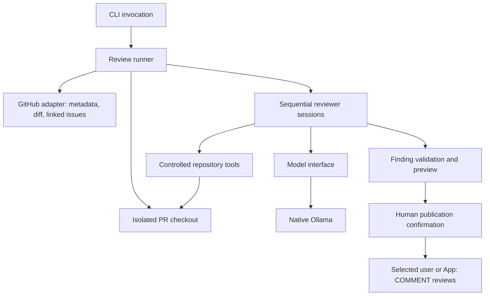

# Architecture

Status: accepted component boundaries; interfaces below are illustrative, not
implemented contracts.

Authentication uses the [shared provider boundary](authentication.md): personal
GitHub account or user-owned App. The core review workflow is independent of that
choice. Provider selection is planned, not yet implemented.

## Component flow



The first implementation runs only MELCHIOR. The eventual sequence is MELCHIOR,
BALTHASAR, CASPER, with explicit model unloading between sessions. Independent
reasoning does not require independent GitHub identities.

## Package boundaries

| Package | Owns |
| --- | --- |
| `cmd/magi` | Arguments, terminal output, confirmation, process exit |
| `internal/config` | Load, validate, and resolve local configuration |
| `internal/githubapp` | App authentication, GitHub reads, review publication |
| `internal/review` | Review orchestration, findings, results, publication policy |
| `internal/agent` | Reviewer state machine and model/tool conversation |
| `internal/model` | Provider-independent inference contracts |
| `internal/model/ollama` | Ollama transport, options, loading/unloading |
| `internal/repo` | Checkout preparation, revision boundaries, cleanup |
| `internal/tools` | Bounded file/search/diff/history/test operations |
| `internal/sandbox` | Future isolated execution of PR code |
| `internal/worker` | Future job leases and worker lifecycle |
| `internal/coordinator` | Future scheduling, durable job state, retries |

The review engine must not import CLI or Docker-specific behavior. Triggering a
review from a terminal, webhook, or worker should call the same underlying runner.

```go
// Illustrative shape; types and names may evolve during implementation.
type ReviewRequest struct {
    Repository  string
    PullRequest int
    HeadSHA     string
}

type ReviewRunner interface {
    Review(ctx context.Context, req ReviewRequest) (ReviewResult, error)
}

type Model interface {
    Chat(ctx context.Context, req ChatRequest) (ChatResponse, error)
    Unload(ctx context.Context) error
}
```

## Review lifecycle

1. Resolve repository and PR from explicit input or the current Git directory.
2. Load trusted local configuration and authenticate through the selected user/App provider.
3. Fetch metadata, changed files, diff, base/head SHAs, and formal issue links.
4. Prepare an isolated checkout of the intended PR revision.
5. Seed the selected reviewer with policy and bounded context.
6. Alternate model responses and controlled tool observations within budgets.
7. Ask that reviewer to try to disprove its candidate findings.
8. Validate findings and requirements assessments; retain uncertain states explicitly.
9. Unload the model before starting a different reviewer's session.
10. Preview results and obtain publication confirmation.
11. Recheck the target revision and publish validated COMMENT reviews.
12. Clean up temporary resources on success, failure, or cancellation.

Base/head SHAs are review boundaries. Do not assume the base branch is `main`.
Before publication, detect a changed PR head and require a fresh review rather than
silently reusing findings from older code. The exact stale-review UX remains open.

## Shared data, separate responsibilities

A shared review context contains PR metadata, source revisions, diff information,
and linked-issue context. BALTHASAR additionally consumes structured requirements.
Not every reviewer needs the full text of every issue in its active context.

Agents return data, not API calls. Validation checks confidence, evidence,
coordinates, and policy. Publication renders that data under the shared MAGI
identity, with each review clearly naming its reviewer role.

Network errors, invalid model output, unavailable issue context, and test failures
must remain distinguishable. A failed reviewer is not a clean review. Never report
"no findings" as if a session completed when it actually aborted.
